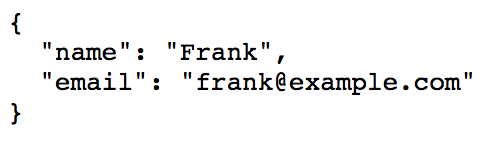

# Purpose

Much of what makes Markdown great is the ability to write plain text,
and get great formatted output as a result. To keep the slate clean for
the next author, your Markdown should be simple and consistent with the
whole corpus wherever possible.

We seek to balance three goals:

1. Source text is *readable* and *portable*.
1. Markdown files are *maintainable* over time and across teams.
1. The syntax is *simple* and *easy to remember*.

This is a guide only.
If one of the below instructions would lead you to do something bizarre
or confusing, do something else.

Adapted from Google's [markdown styleguide](https://github.com/google/styleguide/tree/gh-pages/docguide).

# Syntax

Always use valid markdown.
Refer to the [markdown documentation](https://daringfireball.net/projects/markdown/syntax)
whenever necessary.

# Document layout

Start every lab with a *Purpose* section that explains what a student 
will accomplish in the lab.
Begin a section with a complete sentence.  
For example:

```markdown
# Purpose

In this lab, you will use Spring Cloud Config to set up a config server
for the MovieFun App.
```

# Character line limit

-   Insert a line break after the end of every sentence.

-   Hard word wrap lines at column 72.
    See [these instructions](https://www.jetbrains.com/help/idea/2016.3/code-style.html#d1653664e66)
    to configure IntelliJ to display a marker line at this width.

-   Do not break up hyperlinks.

-   If the wrap line intersects the text part of the link, put the
    entire link on the next line.

-   If the wrap line intersects the URL part of the link, break after
    the URL.

-   Do not wrap inside of code blocks.
    Preserve the code's original formatting exactly.

# Trailing whitespace

Do not use trailing whitespace, use a trailing backslash.

The [CommonMark spec](http://spec.commonmark.org/0.20/#hard-line-breaks)
decrees that two spaces at the end of a line should insert a `<br />`
tag.
However many IDEs will clean up trailing whitespace.

Best practice is to avoid the need for a `<br />` altogether.
Markdown creates paragraph tags for you simply with newlines: get used
to that.

# Headings

## ATX-style headings

```markdown
## Heading 2
```

Headings with `=` or `-` underlines can be annoying to maintain and do
not fit with the rest of the heading syntax.
The user has to ask: Does `---` mean H1 or H2?

```markdown
Heading - do you remember what level? DO NOT DO THIS.
---------
```

## Add spacing to headings

Prefer spacing after `#` and newlines before and after:

```markdown
...text before.

# Heading 1

Text after...
```

Lack of spacing makes it a little harder to read in source:

```markdown
...text before.

#Heading 1
Text after... DO NOT DO THIS.
```

## Heading content

Capitalize only the first word of each heading, unless other words of
the heading must be capitalized according to common rules.

Do not include numbers or punctuation in headings.

- _DO_: `# All about shunting`
- _DO NOT_: ~~`# 2. All about shunting`~~
- _DO NOT_: ~~`# All about shunting.`~~

Write headings in imperative case.

- _DO_: `# Migrate local DBs`
- _DO NOT_: `# Migrating local DBs`

Write main headings as top level headings.
Keep nesting to a maximum of two levels.
See the example below.

```markdown
# A tale of two towers

The lysine contingency - it's intended to prevent the spread of the 
animals is case they ever got off the island. Dr. Wu inserted a gene 
that makes a single faulty enzyme in protein metabolism.

## The tale of the first tower

Well, the way they make shows is, they make one show. That show's called
a pilot. Then they show that show to the people who make shows, and on 
the strength of that one show they decide if they're going to make more 
shows.

### The staircase story

The path of the righteous man is beset on all sides by the iniquities of
the selfish and the tyranny of evil men. Blessed is he who, in the 
name of charity and good will, shepherds the weak through the valley of 
darkness.

## The tale of the other tower

You see? It's curious. Ted did figure it out - time travel. And when we 
get back, we gonna tell everyone..

# A tale of two fish

You think water moves fast? You should see ice. It moves like it has a 
mind. Like it knows it killed the world once and got a taste for murder. 
```

# Lists

Use a list to represent a collection containing two or more items.

## Use lazy numbering for long lists

Markdown is smart enough to let the resulting HTML render your numbered
lists correctly.
Always use *lazy* numbering:

```markdown
1.  Foo.
1.  Bar.
    1.  Foofoo.
    1.  Barbar.
1.  Baz.
```

Always use `1.` to denote ordered lists.

- _DO_: `1.  Strangling the monolith`
- _DO NOT_: ~~`2.  Strangling the monolith`~~
- _DO NOT_: ~~`1)  Strangling the monolith`~~
- _DO NOT_: ~~`2)  Strangling the monolith`~~

If you find that you must resort to manual numbering to get the desired
result there is an error elsewhere in your markdown.

Always use `-` to denote unordered lists.

## Nested list spacing

When nesting lists, use a 4 space indent for both numbered and bulleted
lists:

```markdown
1.  2 spaces after a numbered list.
    4 space indent for wrapped text.
1.  2 spaces again.

-   3 spaces after a bullet.
    4 space indent for wrapped text.
    1.  2 spaces after a numbered list.
        8 space indent for the wrapped text of a nested list,
    1.  Looks nice, right?
-   3 spaces after a bullet.
```

The following works, but it is very messy:

```markdown
- One space,
with no indent for wrapped text.
     1. Irregular nesting... DO NOT DO THIS.
```

Even when there is no nesting, using the 4 space indent makes layout
consistent for wrapped text:

```markdown
-   Foo,
    wrapped.

1.  2 spaces
    and 4 space indenting.
2.  2 spaces again.
```

However, when lists are small, not nested, and a single line, one space
can suffice for both kinds of lists:

```markdown
- Foo
- Bar
- Baz.

1. Foo.
1. Bar.
```

# Code

## Inline

&#96;Backticks&#96; designate `inline code`, and will render all wrapped
content literally.
Use them for short code snippets and field names:

```markdown
You will want to run `really_cool_script.sh arg`.

Pay attention to the `foo_bar_whammy` field in that table.
```

Use inline code when referring to file types in an abstract sense,
rather than a specific file:

```markdown
Be sure to update your `README.md`!
```

Backticks are the most common approach for *escaping* Markdown
metacharacters; in most situations where escaping would be needed, code
font just makes sense
anyway.

Do not use inline code blocks for items that are not code or field
names.

## Code blocks

Favor code blocks over inline code.

    ```python
    def Foo(self, bar):
      self.bar = bar
    ```

When it is appropriate to embed an entire file, rather than paste the
contents of the file, use the custom GitHub embed tag.

```markdown
{{github-file owner="platform-acceleration-lab" repo="apps-movie-fun-code" path="applications/movie-fun-app/src/main/java/org/superbiz/moviefun/SecurityConfig.java" ref="security" lang="java"}}
```

If only a subset of the file is needed, link to the file in the
repository and paste the code inline.

Annotate code fences containing code with the appropriate language name.

    ```kotlin
    fun bringMaiTai() : Drink {
        return MaiTai("the glass is overflowing")
    }
    ```

### Shell commands

Put shell commands inside of code blocks.
Do not precede input lines with prompt characters (i.e. `$`).

- DO: `cf push`
- DO NOT: ~~`$ cf push`~~

Annotate code fences containing output with `no-highlight`.

    ```no-highlight
    Change detected, rebuilding site
    2017-01-24 13:56 -0700
    Source changed /Users/pivotal/workspace/hugo-pui-theme-example/content/styleguide.md
    Built site for language en:
    ```

Preface shell commands with a description of what the command will
accomplish.
The goal is to enable the user to recreate the shell command even if the
code block is hidden or if the user is using a different shell.
For example:

    View the contents of the resulting jar file to see that the gradle
    subprojects are included:
    
    ```bash
    unzip -l build/libs/pickle.jar
    ```  

### Escape newlines

Because most command line snippets are intended to be copied and pasted
directly into a terminal, it is best practice to escape any newlines.
Use a single backslash at the end of the line:

    ```shell
    bazel run :target -- --flag --foo=longlonglonglonglongvalue \
    --bar=anotherlonglonglonglonglonglonglonglonglonglongvalue
    ```

### Nest code blocks within lists

If you need a code block within a list, make sure to indent it so as to
not break the list:

```markdown
-   Bullet.

    ```c++
    int foo;
    ```

-   Next bullet.
```

### Make code executable

All code blocks and inline code should be executable or should compile.

-   Add language-appropriate comments for any ellipses or asides within
    code-blocks.
    For example:
    
    ```kotlin
    fun getDrink() : Drink {
        //...
        return MaiTai("the glass is overflowing") //always returns a MaiTai
    }
    ```
    
-   Use language-appropriate variable if values within a code-block can
    change.
    For example:

    ```bash
    cf login -a "https://api.sys.${FOUNDATION_NAME}.pal.pivotal.io"
    ```

# Links

Long links make source Markdown difficult to read and break the 80
character wrapping.
**Wherever possible, shorten your links**.

### Use informative Markdown link titles

Markdown link syntax allows you to set a link title, just as HTML does.
Use it wisely.

Titling your links as *link* or *here* tells the reader precisely
nothing when quickly scanning your doc and is a waste of space:

```markdown
See the syntax guide for more info: [link](syntax_guide.html).
Or, check out the style guide [here](style_guide.html).
Finally, check the example site <https://example.com>
DO NOT DO THIS.
```

Instead, write the sentence naturally, then go back and wrap the most
appropriate phrase with the link:

```markdown
See the [syntax guide](syntax_guide.html) for more info.
Or, check out the [style guide](style_guide.html).
Finally, check the [example site](https://example.com).
```

# Images

Use images sparingly, and prefer simple screenshots.
This guide is designed around the idea that plain text gets users down
to the business of communication faster with less reader distraction and
author procrastination.
However, it is sometimes very helpful to show what you mean.

Always include text, such as a json response or console output, in a
code block rather than an image.

This

```json
{
  "name": "Frank",
  "email": "frank@example.com"
}
```

is much more useful to a developer than this



# Prefer lists to tables

Any tables in your Markdown should be small.
Complex, large tables are difficult to read in source and most
importantly, **a pain to modify later**.

```markdown
Fruit | Attribute | Notes
--- | --- | --- | ---
Apple | [Juicy](https://example.com/SomeReallyReallyReallyReallyReallyReallyReallyReallyLongQuery), Firm, Sweet | Apples keep doctors away.
Banana | [Convenient](https://example.com/SomeDifferentReallyReallyReallyReallyReallyReallyReallyReallyLongQuery), Soft, Sweet | Contrary to popular belief, most apes prefer mangoes.

DO NOT DO THIS
```

[Lists](#lists) and subheadings usually suffice to present the same
information in a slightly less compact, though much more edit-friendly
way:

```markdown
## Fruits

### Apple

- [Juicy](https://SomeReallyReallyReallyReallyReallyReallyReallyReallyReallyReallyReallyReallyReallyReallyReallyReallyLongURL)
- Firm
- Sweet

Apples keep doctors away.

### Banana

- [Convenient](https://example.com/SomeDifferentReallyReallyReallyReallyReallyReallyReallyReallyLongQuery)
- Soft
- Sweet

Contrary to popular belief, most apes prefer mangoes.
```

However, there are times when a small table is called for:

```markdown
Transport | Favored by | Advantages
--- | --- | ---
Swallow | Coconuts | Otherwise unladen
Bicycle | Miss Gulch | Weatherproof
X-34 landspeeder | Whiny farmboys | Cheap since the X-38 came out
```

# Avoid HTML

Do not use HTML tags in markdown.

Every bit of HTML or Javascript hacking reduces the readability and
portability.
This in turn limits the usefulness of integrations with other tools,
which may either present the source as plain text or render it.

# Emphasis

**Bold** and *italics* are used for emphasis.

-   Use bold and italics as little as possible.
    If everything is emphasized, then nothing is emphasized.
-   Limit use of bold and italics to words and short phrases.
    Bold and italics are designed to stand out from other text, and are
    therefore harder to read.
    Never use bold or italics for entire sentences or paragraphs.
-   Bold and italics are mutually exclusive.
-   As a rule, use italics for gentle emphasis and use bold for heavy
    emphasis.
    Use *italics* when defining new terms.
-   Use backticks, rather than bold or italics, for inline code.
    For example:

    ```markdown
    Writing *Kotlin* is **much** more enjoyable than writing Java.
    Say goodbye to `NullPointerExceptions`.
    ```

# Quotations

Use quotation marks and block quotes only for direct quotations.
It is not appropriate to use quotation marks for new definitions or for
emphasis.
If you feel the urge to use quotation marks in another situation,
refer to the [Emphasis Section](#emphasis).

Use double quotes for quotations rather than single quotes.

```markdown
I like to keep Bill Murray's wise words in mind: "Sometimes I snore,
like when I get really tired."
```

# Miscellaneous

Remember: Always be kind and you can't fix stupid.
