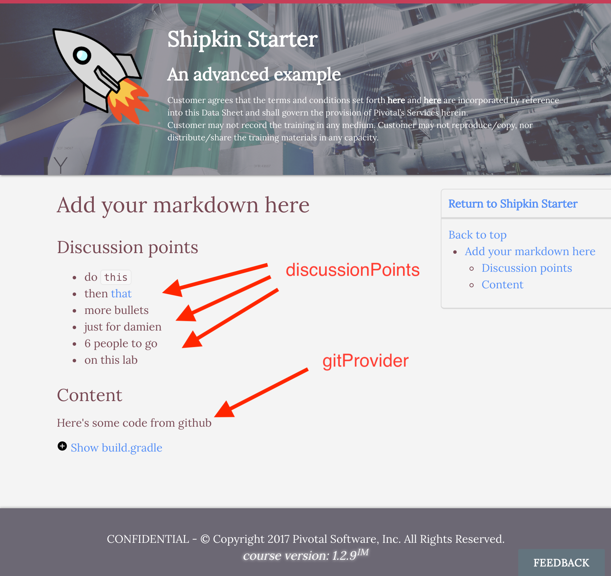

# Creating a Lab

## Markdown

The body of the lab content is written in markdown.
Shipkin uses the [Commonmark](http://commonmark.org/) flavor of
Markdown, with a few extensions which are [described below](#extensions)
(the [Commonmark Java](https://github.com/atlassian/commonmark-java)
implementation, to be precise).

## Top matter

The top matter is an optional block at the beginning of a markdown file.

```yaml

---
pageTitle: An advanced example
discussionPoints:
  - do `this`
  - then [that](http://example.com)
  - more bullets
  - just for damien
  - 6 people to go
  - on this lab
wrapUp:
  - that's a wrap
  - thumbs up
instructorNotes: |
  ## Lorem ipsum
  Dolor sit amet, consectetur adipiscing elit. Nam non
  lorem nunc. Pellentesque feugiat tellus vitae lacus consectetur
  lobortis. **Proin** semper tortor a interdum interdum. Quisque feugiat
  - Praesent ut mi nec
  - nibh semper porttitor.
  - Curabitur vel lobortis felis.

  ## Pellentesque habitant
  Morbi tristique senectus et netus et malesuada
  fames ac turpis egestas.

favoriteAnimal: turtle
---

```

The `pageTitle` will be rendered as the subtitle of the page on the
current page header banner and appended to the html-title of the page.

The `discussionPoints` can be referenced like this
`::discussionPoints::` anywhere in the markdown.

Discussion Points are viewable as a [slide](#slides) while in
instructor mode.

The `wrapUp` can be referenced like this `::wrapUp::` anywhere in the
markdown.

Wrap up is viewable as a [slide](#slides) while in instructor mode.
If no wrap up is available, the wrap up slide will show the discussion
points.

The `instructorNotes` can consist of arbitrary markdown to be used by
instructors during delivery.

Other variables in the top matter can be referenced within the markdown.
For example, the `favoriteAnimal` can be referenced like this
`Animal: ::favoriteAnimal::` anywhere in the markdown and will be
rendered as: `Animal: turtle`.

